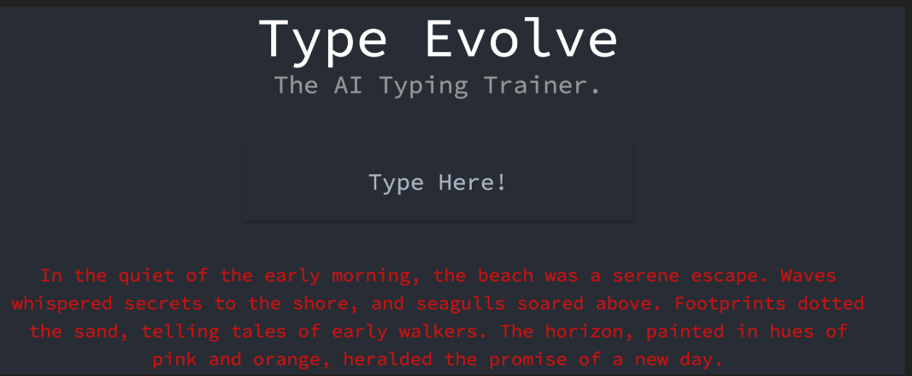

  
## <strong>[View the demo here!](https://www.youtube.com/watch?v=kURE0gySzmw)</strong>

# Inspiration
The realm of computer technology education is facing a pivotal challenge: a marked decline in touch typing proficiency using the QWERTY keyboard. This vital skill is being increasingly overshadowed by the rise of two-finger smartphone typing, leading to diverse, inefficient hunt-and-peck methods. This shift underscores the urgent need for effective typing tools in educational contexts.

The concept of formal typing instruction has gradually been marginalized, partly influenced by the notion, popularized by Marc Prensky in his 2011 article [“Digital Natives, Digital Immigrants](https://www.marcprensky.com/writing/Prensky%20-%20Digital%20Natives,%20Digital%20Immigrants%20-%20Part1.pdf), that such skills are redundant for the so-called "digital natives" – a term Prensky coined to describe the post-1980s generation. This demographic was perceived to inherently acquire technological skills like typing through everyday interactions with digital devices. However, contrary to these expectations, research indicates a different reality.

A pivotal observation the MIT Technology Review article ["Out of Touch with Typing" ](https://www.technologyreview.com/2011/08/15/22130/out-of-touch-with-typing/) in 2011 highlights this gap: "Most [young people] develop idiosyncratic, personalized hunt-and-peck methods...Many do not touch type...if there's one 'right way' to type...I don’t think many of us know it." This comment encapsulates a common trend among the younger generation, where despite early exposure to technology, formal keyboard skills are not instinctively acquired.

Further supporting this concern is a study titled ["Challenging the Myth of the Digital Native: A Narrative Review"](gov/37092480/), published in the MDPI Nursing Reports journal in April 2023. The study reveals the broader implications of this educational oversight. It underscores how the myth of the digital native, which suggests innate digital literacy from mere exposure to technology, has led to gaps in critical skills, including those essential for nursing and patient care. The report emphasizes, "Digital literacy is an essential requirement...The myth of the Digital Native negates the reality that exposure to digital technologies does not equate digital literacy and has resulted in deficits in nursing education programs."

These insights collectively underscore the necessity to reevaluate and reinforce typing education, particularly touch typing, in the digital age. Our project aims to bridge this gap by offering an engaging, effective, and adaptive typing tutor to foster these essential skills in learners of all ages.

# Project Overview
To bridge the gap in contemporary typing education, we introduce "Type Evolve," an AI-powered interactive typing tutor. This system presents users with a novel approach to enhancing typing proficiency through customized stories, each spanning one to three lines. During engagement with these stories, "Type Evolve" tracks a range of metrics including typing speed, accuracy, and both the nature and frequency of errors at the word and individual key levels. Upon completing each story, users are provided with a summary of these metrics, accompanied by a keyboard heat map. This heat map graphically depicts challenging areas, emphasizing both frequently missed target keys and incorrect key presses.

Users can then choose to generate a new prompt, where the collected metrics are injected into customized instruction which are subsequently fed through state-of-the-art large language model (LLM) that powers Type Evolve. The generated output is a customized prompt that is tailored to address deficiencies in the user's prior performance.
In a unique application of natural language processing (NLP) technology, "Type Evolve" employs an optimized large. Overall, this adaptive approach promises a dynamic and continuously evolving learning experience for each user.

# Technical Architecture
### Frontend
The front-end is a [React](https://github.com/facebook/react) application and [node.js](https://github.com/nodejs/node) is used for the runtime environment. [Axios](https://github.com/axios/axios), an HTTP Client for node.js, is used to send and receive requests from the llama.cpp server.

### Backend
[Llama.cpp](https://github.com/ggerganov/llama.cpp) is used as the runtime for the models. This choice was made due to its ability to run [GGUF](https://github.com/ggerganov/ggml/blob/master/docs/gguf.md) files, which support quantization. This is when model parameters, typically stored as 16-bit floating point numbers, are scaled down (e.g., to 4-bit integers) to save computational resources without significantly impacting the model’s capabilities. This drastically reduces computational resources while maintaining the model’s effectiveness. A significant advantage of this approach is the elimination of the need for high-end computing hardware, such as dedicated GPUs. Consequently, these models can be efficiently run on [consumer hardware](https://github.com/ggerganov/llama.cpp/discussions/4167). This is practically demonstrated in the provided video demonstration, where "Llama.cpp" runs a 7-billion (7B) parameter LLM seamlessly on a 2020 MacBook Pro equipped with an M1 chip.

A variety of LLM models with different architectures can be run using llama.cpp, including Llama, Mistral, and Gemma. In the provided video demonstration, the current model being used is  [CapybaraHermes-2.5-Mistral-7B](https://huggingface.co/argilla/CapybaraHermes-2.5-Mistral-7B), which a preference tuned [OpenHermes-2.5-Mistral-7B](https://huggingface.co/teknium/OpenHermes-2.5-Mistral-7B) using argilla's [dpo mix 7k](https://huggingface.co/datasets/argilla/dpo-mix-7k). It has been recognized as a robust 7B model, as evidenced by its impressive 7.91 score on the [MTBench](https://huggingface.co/spaces/lmsys/mt-bench) evaluation platform. For reference, the [MTBench paper](https://arxiv.org/abs/2306.05685) reports that ChatGPT-3.5, the OpenAI proprietary model that is consists of over 175 billion parameters, achieves only a marginally higher score of 7.94.

To host the model, we use the [server](https://github.com/ggerganov/llama.cpp/tree/master/examples/server) that is included with llama.cpp, since it is a lightweight OpenAI API compatible HTTP server. This allowed the usage of the [OpenAI Chat Completions API](https://platform.openai.com/docs/api-reference) for straightforward execution of cURL requests containing messages formatted for utilizing the LLM as a chat assistant.
